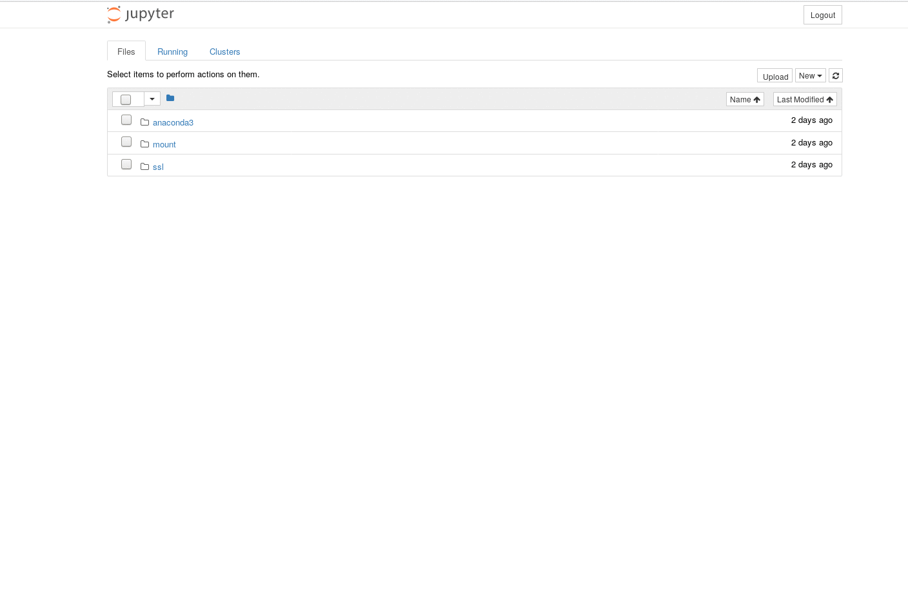

# miniconda-python3-ssl-docker
A [Miniconda](https://conda.io/miniconda.html) [Jupyter](http://jupyter.org/) container, secured with SSL.

This image includes a Miniconda installation and automatically generates SSL certificates on startup.

`conda` and `pip` are added to the path, `wget` is installed to grab data from everywhere.

There's also a smaller image available, which is based on miniconda instead of anaconda.

Miniconda is like anaconda, but instead of having a lot of packages preinstalled, only python and conda are present (jupyter will be installed during image building), but all packages which are available in anaconda are available through the `conda` command.

|Installation|Image Size|Link|
|------------|----------|----|
|[Anaconda](https://www.anaconda.com/download/)|2GB|https://github.com/sauercrowd/anaconda-python3-ssl-docker|
|[Miniconda](https://conda.io/miniconda.html)|452MB|https://github.com/sauercrowd/miniconda-python3-ssl-docker|

## Usage

I recommend to mount a folder from the docker host, to be able move data from the container to the host and vice versa.

### Run

```
$ docker run -d -p 8888:8888 \
    -v `pwd`/jupyter-mount:/home/conda/jupyter-mount \
    --name miniconda \
    jonadev95/miniconda-python3-ssl-docker
```

### Get the login token

In order to be able to log in you need the token generated by jupyter, so execute
```
$ docker logs miniconda
```

and search for the line
```
[C 21:54:40.449 NotebookApp] 
    
    Copy/paste this URL into your browser when you connect for the first time,
    to login with a token:
        https://0.0.0.0:8888/?token=xxxxxxxxxxxxxxxxxxxxxxxxxxxxxxxxxxxxxxxxxxxxxxxx
```

Now either

- Copy the whole URL, replace `0.0.0.0` with the docker host IP and follow that link
- Just copy the token, go to `https://$HOST_IP:8888` and use the token to login

Both methods will log you in perfectly, but when using the latter method firefox will save the token as a password so you don't need to look it up again

## Install additional packages

Jupyter Notebooks got a buil-in terminal, which makes it easy to install additional packages. Just use `pip` or `conda` to install whatever you want, or grab datasets with `wget`.



### Note
Root access/sudo is disabled for security reasons, which means you're not able to install packages via `apt-get`.

## TODO

- do not regenerate SSL certificates on container restarts
- use the same token for the jupyter notebook on container restarts